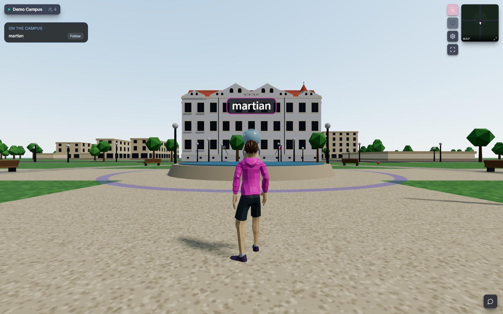
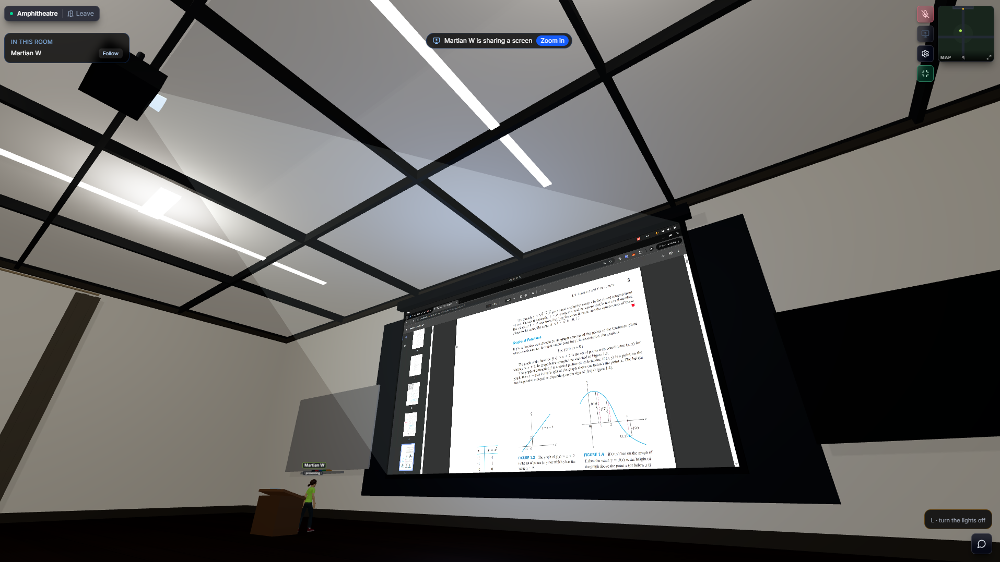
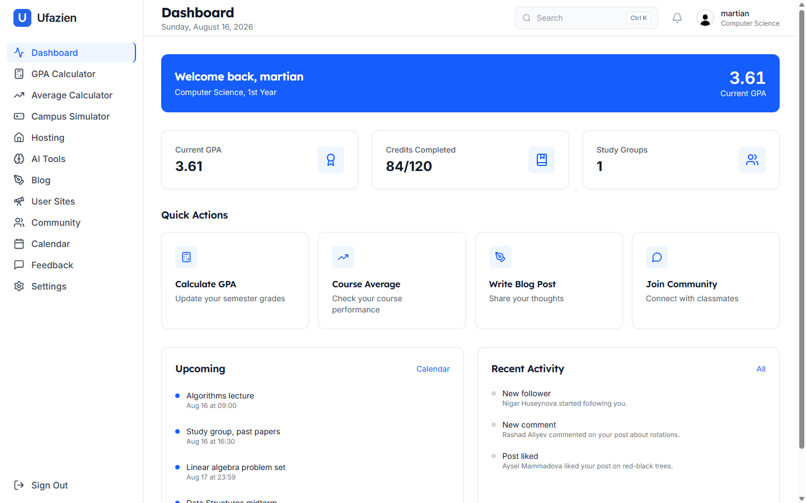
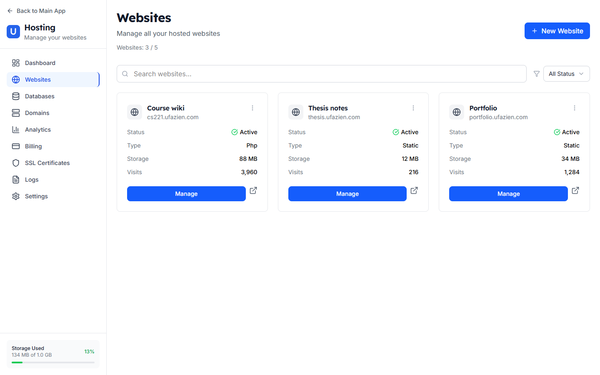
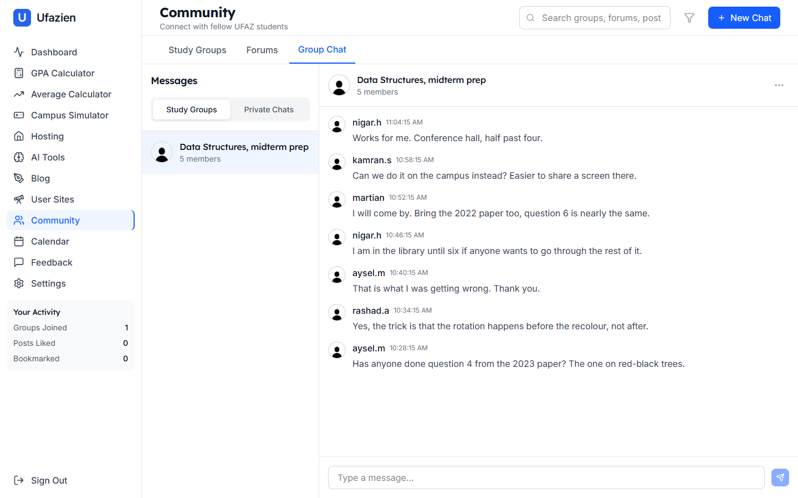
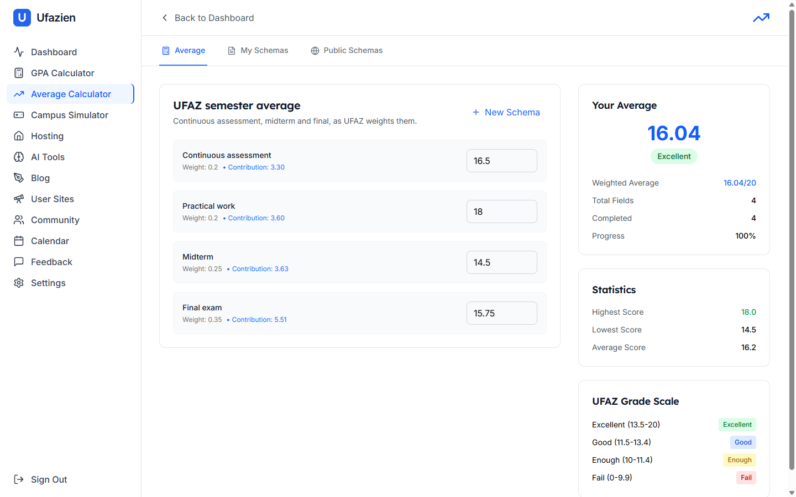

# Ufazien

**A student platform for UFAZ: calculators, a blog, a community, web hosting, and a multiplayer 3D campus.**

---

## What it is

Ufazien is a platform built for students at the French-Azerbaijani University. It started as a GPA calculator and grew into the tools students kept asking for: somewhere to write, somewhere to talk, somewhere to put their projects online, and a campus they can walk around together.

It runs at **[ufazien.com](https://ufazien.com)**.

## What you can do with it

**Work out your grades.** A GPA calculator with semesters, targets and grade conversion. An average calculator where you build a grading schema once and publish it, so classmates reuse it instead of rebuilding the same spreadsheet every term.

**Put your project online.** Every user gets subdomains under `*.ufazien.com`, static or PHP hosting, provisioned MySQL and PostgreSQL databases, and TLS. Deploy from the dashboard or with the [`ufazien-cli`](https://github.com/martian56/ufazien-cli).

**Write and read.** A blog with a rich text editor, image uploads, categories and tags.

**Talk to people.** Study groups with real-time chat, plus forums, posts and threaded replies.

**Meet on campus.** A multiplayer 3D campus you can walk around with other students. Voice fades with distance, so conversations happen where you're standing. Buildings can be entered, and inside there's a board for screen sharing, enough to run a study session or a lecture, with the host controlling who can speak and present.

**Ask an AI.** A text humanizer backed by Azure OpenAI, with more tools planned.

## A look at it

<table>
<tr>
<td colspan="2"></td>
</tr>
<tr>
<td colspan="2"><b>A lecture, inside the building.</b> Someone shares their screen and it lands on the projector in the room, not pasted over your view. Voice fades with distance, so the back row can whisper. The host decides who may speak and present, and the server issues the publishing rights to match.</td>
</tr>
<tr>
<td width="50%"></td>
<td width="50%"></td>
</tr>
<tr>
<td><b>Dashboard.</b> Where your term stands, what is next, and who has been in touch. <code>Ctrl K</code> opens search from anywhere.</td>
<td><b>Hosting.</b> Student projects on their own subdomains, with storage, traffic and TLS.</td>
</tr>
<tr>
<td></td>
<td></td>
</tr>
<tr>
<td><b>Community.</b> Study groups with real-time chat, plus forums and threaded replies.</td>
<td><b>Average calculator.</b> Build a weighted schema once, publish it, and the rest of your year reuses it.</td>
</tr>
</table>

## How it fits together

A Django REST API with WebSocket consumers for anything real-time, and a React single-page app in front of it.

| Layer | Built with |
|---|---|
| **API** | Django 5.2 · Django REST Framework · JWT auth · drf-spectacular |
| **Real-time** | Django Channels, for campus positions, group chat and notifications |
| **Voice & screen share** | LiveKit, with publishing rights issued server-side per participant |
| **Frontend** | React 19 · Vite · Tailwind CSS · three.js via react-three-fiber |
| **Data** | PostgreSQL for the app; per-user MySQL and PostgreSQL for hosted projects |
| **Edge** | Traefik, wildcard TLS across `*.ufazien.com` |

API reference is generated from the code and served at **[api.ufazien.com/api/docs/](https://api.ufazien.com/api/docs/)**.

## Contributing

Contributions are welcome: bug reports, fixes and features alike.

**Start with [CONTRIBUTING.md](CONTRIBUTING.md).** It covers getting the project running locally, how branches and pull requests work here, and what CI expects before a change can merge.

By taking part you agree to the [Code of Conduct](CODE_OF_CONDUCT.md).

Found a security problem? Please don't open a public issue. See the [Security Policy](SECURITY.md).

## License

[MIT](LICENCE) © Fuad Alizada
